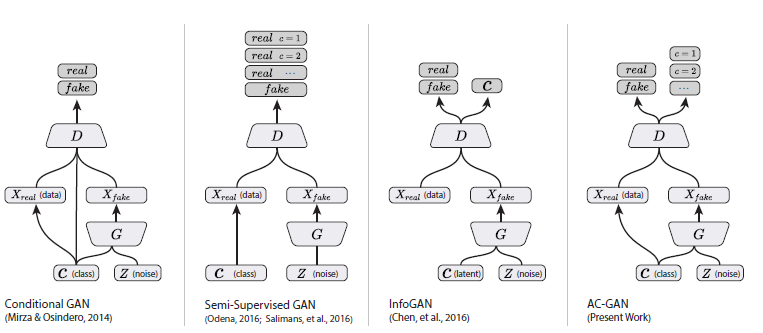
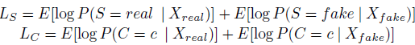
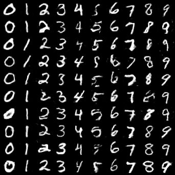
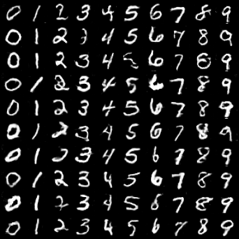
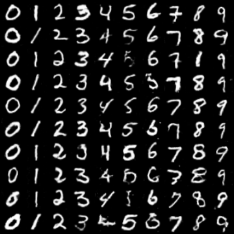

# Auxiliary Classifier GAN
[AC-GAN](https://arxiv.org/pdf/1610.09585) is proposed to facilitate conditional image synthesis. It can obtain higher quality samples by adding more structure to the GAN latent space along with a specialized cost function.

The following image compares several methods. Unlike CGAN, the latent variable $C$ (such as the classes) does not serve as an input of discriminators in AC-GAN.
<p align="middle">
    
</p>

## Algorithm
In the AC-GAN, every generated sample has a corresponding class label, $c \sim p_c$ in addition to the noise $z$. $G$ uses both to generate images $X_{fake} = G(c, z)$. The discriminator gives both a probability distribution over sources and a probability distribution over the class labels, $P(S | X)$, $P(C | X) = D(X)$. The objective function has two parts: the loglikelihood of the correct source, $L_S$, and the log-likelihood of the correct class, $L_C$. $L_S$ and $L_C$ are defined as following
<p align="middle">
    
</p>
$D$ is trained to maximize $L_S + L_C$ while $G$ is trained to maximize $L_C − L_S$. AC-GANs learn a representation for $z$ that is independent of class label.

## Example
```
python acgan/acgan.py --n_epochs 200 --batch_size 64 --image_size 32 --latent_dim 100
```

## Results
Images generated by generators at different iterations with numbers indicating how many batches have been used to feed the generator. (62400 -> 131200 -> 187200)
<p align="middle">
    
    
    
</p>
