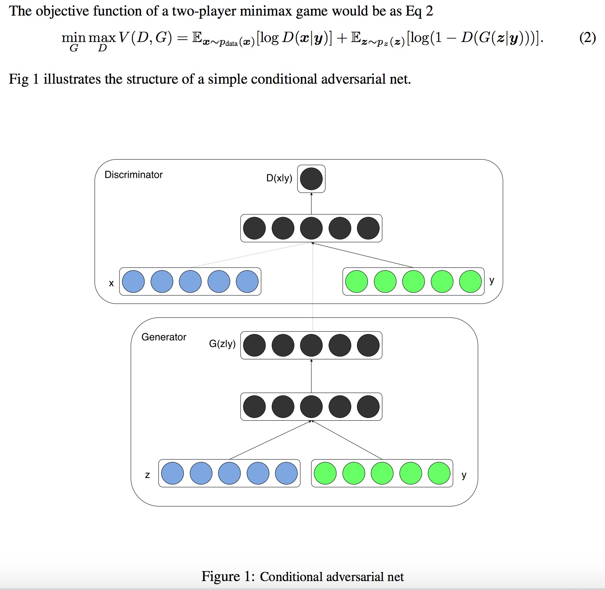
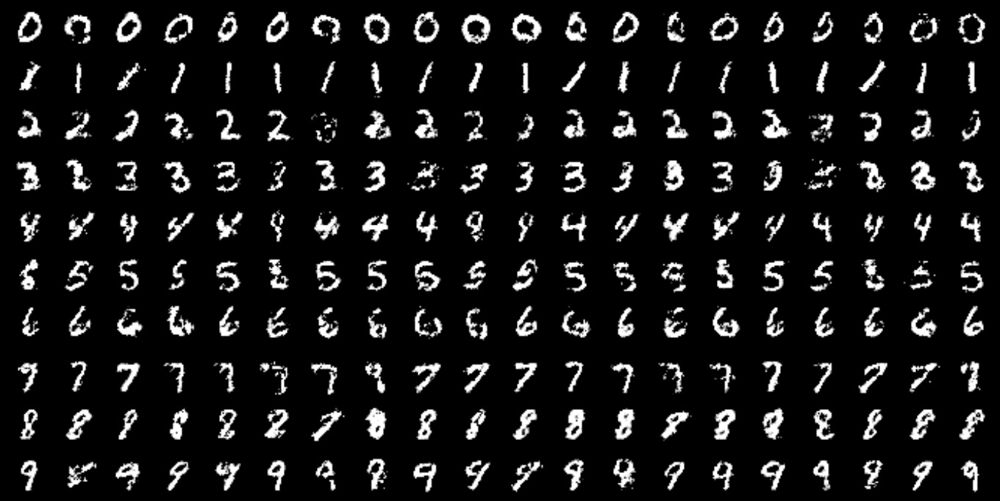
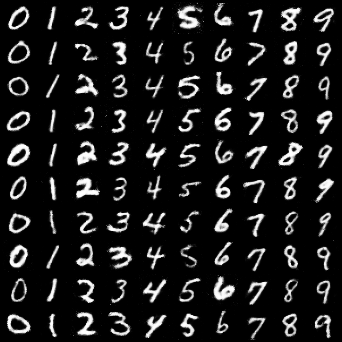

# Conditional GAN
[CGAN](https://arxiv.org/abs/1411.1784), the conditional version of generative adversarial nets, could control the modes of the data being generated. Conditions (such as class labels or some part of data) serve as additional input for both generators and discriminators. The loss is still adversarial loss, same as original GAN.

## Algorithm
<p align="middle">
    
</p>

## Example
```
python cgan/cgan.py --n_epochs 200 --batch_size 64 --image_size 28 --latent_dim 100
```
## Results
The first image shows some of the generated samples in CGAN paper. Each row is conditioned on one label and each column is a different generated sample. The second image is our code result, where each column is conditioned on one label.

<p align="middle">
    
</p>
<p align="middle">
    
</p>
