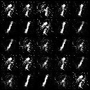

# Generative Adversarial Nets
[Original paper](https://arxiv.org/abs/1406.2661)
## Algorithm
<p align="middle">
    
</p>

## Example
```
python gan/gan.py --n_epochs 200 --batch_size 64 --image_size 28 --latent_dim 100 --k 3
```
## Results
Images generated by generators at different stages with image numbers indicates
how many batches have been used to update the generator. (0 -> 400 -> 800 -> 1200 -> 2400 > 4800)


<p align="middle">
    
    
    
</p>
<p align="middle">
    
    
    
</p>