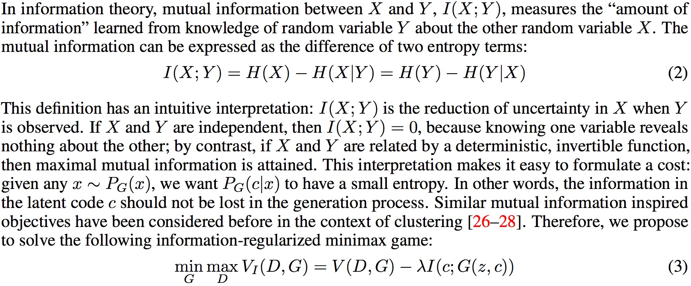
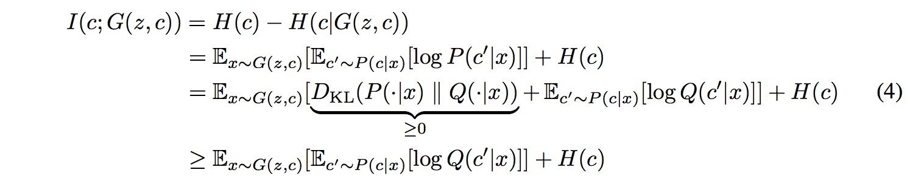
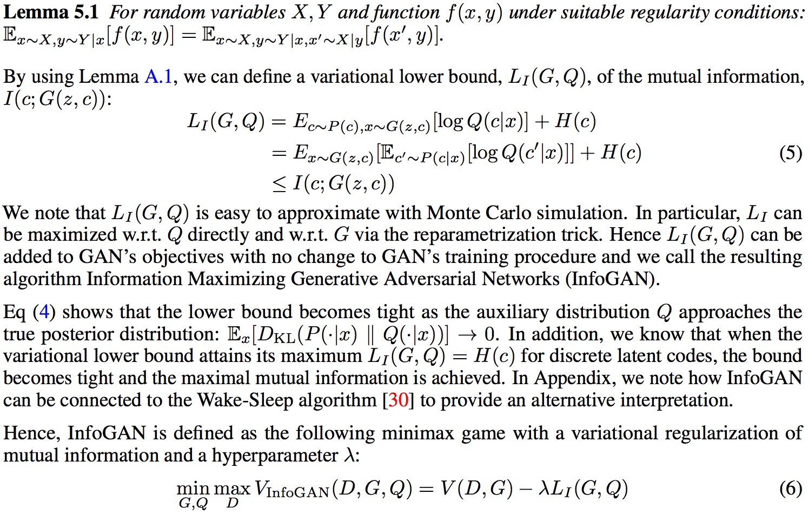
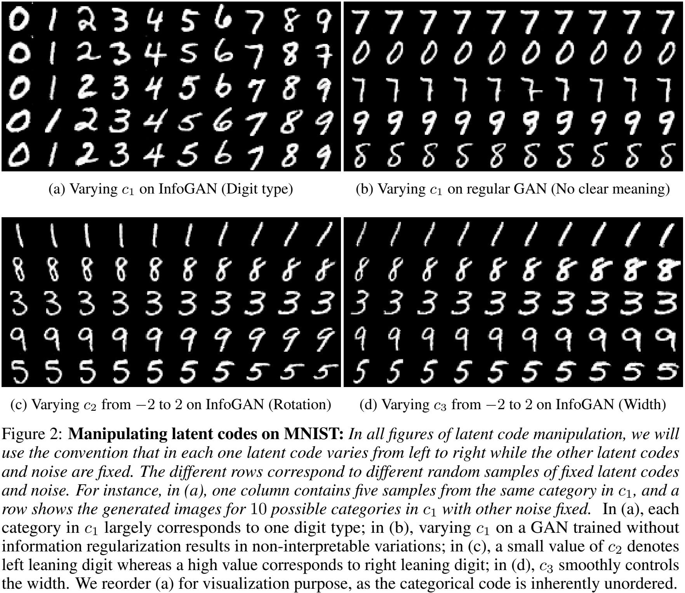
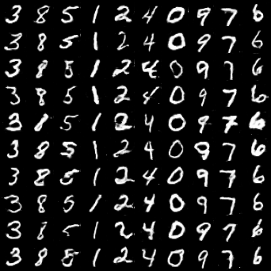
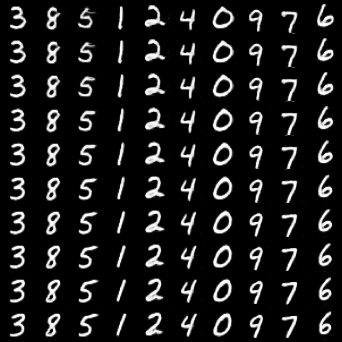
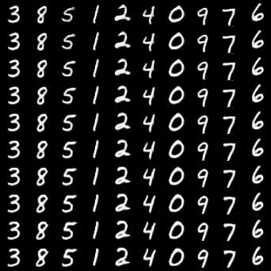

# Infomation GAN
[InfoGAN](https://arxiv.org/pdf/1606.03657), an information-theoretic extension to the Generative Adversarial Network that is able to learn disentangled representations in a completely unsupervised manner. It does so by maximizing the mutual information between a fixed small subset of the GAN’s noise variables and the observations, which turns out to be relatively straightforward. Similar to CGAN, InfoGAN is another way of incorporating additional controllable information to enhance generators.

## Algorithm
#### Main idea
<p align="middle">
    
</p>

#### Variational Mutual Information Maximization
In practice, the mutual information term $I(c; G(z, c))$ is hard to maximize directly as it requires access to the posterior $P(c|x)$. A typical solution is to approximate $P(c|x)$ by an tractable auxiliary distribution $Q(c|x)$, which can be trained by maximizing a lower bounding mutual information as following
<p align="middle">
    
</p>
<p align="middle">
    
</p>

## Example
```
python cgan/cgan.py --n_epochs 200 --batch_size 64 --image_size 32 --latent_dim 62 --code_dim 2
```
## Results

#### Disentangled Representation
The following figure is referred from InfoGAN paper to show the disentangled representation power of InfoGAN.
<p align="middle">
    
</p>

#### Our Code Result
The following images are all generated at iteration 184000. The left one shows the result of varying categorical latent variable by column. The right two images show the result of varying two continuous latent variables by row.
<p align="middle">
    
    
    
</p>


