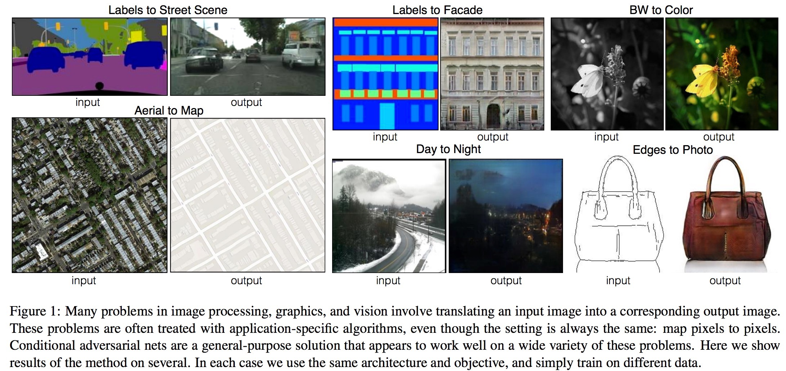

# Image-to-Image Translation with CGANs

The goal in image-to-image translation problems is to translate an input image into a corresponding output image (see Figure 1). [Pix2pix](https://arxiv.org/abs/1611.07004) uses the framweork of CGAN to solve it. These networks not only learn the mapping from input image to output image, but also learn a loss function to train this mapping. This makes it possible to apply the same generic approach to problems that traditionally would require very different loss formulations. It is demonstrated that this approach is effective at synthesizing photos from label maps, reconstructing objects from edge maps, and colorizing images, among other tasks.
<p align="middle">
    
</p>

## Algorithm

#### Objectives

The objective is the mix of the adversary loss of CGANs (equation 1), i.e.,
<p align="middle">
    
</p>
 and a traditional loss. Here it uses L1 regularizationn (equation 3), i.e.,
<p align="middle">
    
</p>

The reason for using L1 distance rather than L2 is that L1 encourages less blurring and makes the output image more consistent with the input image.

####  Generator Architectures
Skip connections are added to the generator net, in order to shuttle the low-level information shared between the input and output directly across the net. The network is named as "U-Net".
<p align="middle">
    
</p>

####  Discriminator Architectures
The final loss (equation 4) restricts the GAN discriminator to only model high-frequency structure, relying on an L1 term to force low-frequency correctness. In order to model high-frequencies, it is sufficient to restrict our attention to the structure in local image patches. The discriminator architecture in Pix2pix is a PatchGAN that only penalizes structure at the scale of patches. This discriminator tries to classify if each N × N patch in an image is real or fake. This discriminator runs convolutionally across the image and averages all responses to provide the ultimate output of D.

#### Training Detail
Adam is used to alternate the parameter updating of D and G. The batch size we used is 1. Therefore, we use instance normalization rather than batch normalization.

## Example
```
python pix2pix/pix2pix.py --n_epochs 200 --batch_size 1 --dataset_name facades
```

## Results

The following figure results from the code, where the task is mapping facades labels to real photos. The first three line is the result of five instances with the first row facades labels, the second row generated photos and the third row the ground truth. The rest can be done in the same manner.

<p align="middle">
    
</p>
