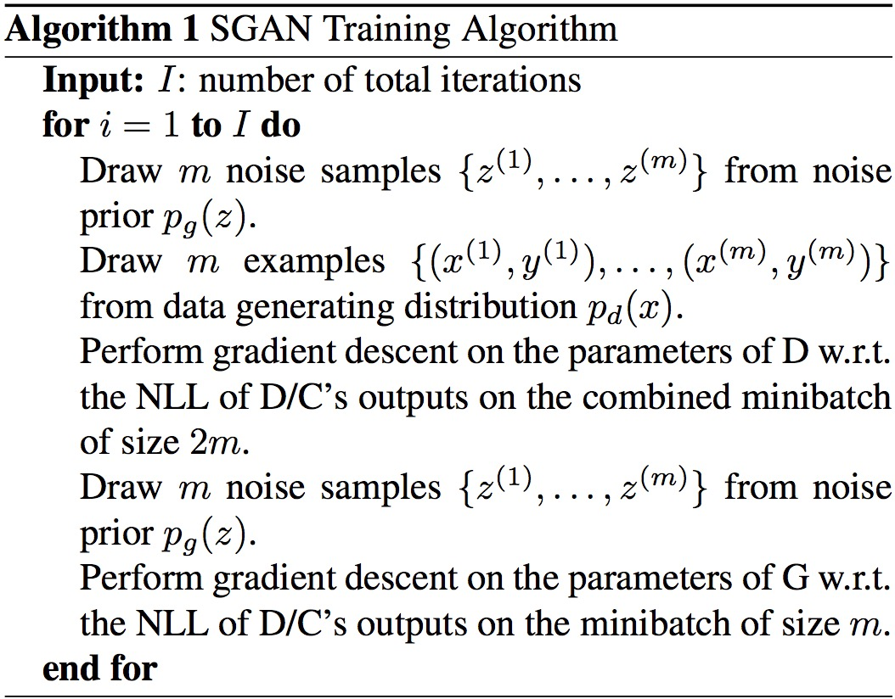
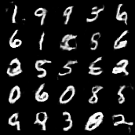
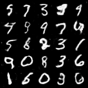
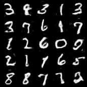

# Semi-Supervised GAN
[SGAN](https://arxiv.org/abs/1606.01583) extends GAN to the semi-supervised context by forcing the discriminator network to output class labels. A generative model $G$ and a discriminator $D$ on a dataset with inputs belonging to one of $N$ classes are trained. At training time, $D$ is made to predict which of $N+1$ classes the input belongs to, where an extra class is added to correspond to the outputs of $G$.

The loss for discriminators in SGAN is composed of a supervised part for real images and a unsupervised part for fake images. By contrast, InfoGAN is in a completely unsupervised manner while ACGAN is in a more supervised manner. A comparison can be seen in the [figure](https://github.com/lx10077/ganpy/blob/master/acgan/images/acgan1.png).

## Algorithm
<p align="middle">
    
</p>

## Example
```
python sgan/sgan.py --n_epochs 200 --batch_size 64 --image_size 28 --latent_dim 100 --clip_value 0.01 --n_critic 5
```

## Results
Images generated by generators at different iterations with image numbers indicates how many batches have been used to feed the generator. (23200 -> 102400 -> 187200)
<p align="middle">
    
    
    
</p>
