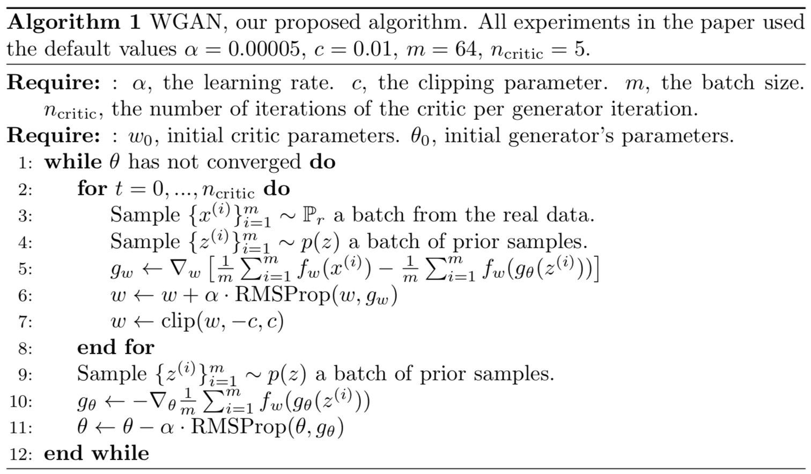
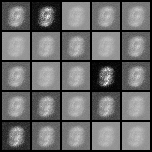
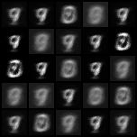
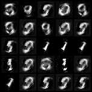
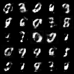
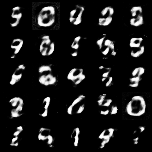

# Wasserstein GAN
[Original paper](https://arxiv.org/abs/1701.07875)

## Algorithm
<p align="middle">
    
</p>

## Example
```
python wgan/wgan.py --n_epochs 200 --batch_size 64 --image_size 28 --latent_dim 100 --clip_value 0.01 --n_critic 5
```

## Results
Images generated by generators at different stages with image numbers indicates
how many batches have been used to update the generator. (400 -> 1600 -> 6400 -> 25600 > 51200 -> 102400)
<p align="middle">
    
    
    
</p>
<p align="middle">
    
    
    
</p>