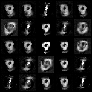

# Wasserstein GAN
Traditional GANs use Jensen-Shannon or f-divergences to measure how close the model distribution and the real distribution are, which may lead to unstable optimization process. [WGAN](https://arxiv.org/abs/1701.07875) overcomes it by using Wasserstein distance, which is also referred as Earth-Mover (EM) distance.

EM is a much more sensible cost function for our problem than at least the Jensen-Shannon divergence, which is the measure the original GAN uses. The following example illustrates how apparently simple sequences of probability distributions converge under the EM distance but do not converge under the other distances.
<p align="middle">
    
</p>

## Relative Strength
The following theorem describes the relative strength of the topologies induced by these distances and divergences, with KL the strongest, followed by JS and TV, and EM the weakest. This highlights the fact that the KL, JS, and TV distances are not sensible cost functions when learning distributions supported by low dimensional manifolds. However the EM distance is sensible in that setup.
<p align="middle">
    
</p>

## Algorithm
<p align="middle">
    
</p>

## Example
```
python wgan/wgan.py --n_epochs 200 --batch_size 64 --image_size 28 --latent_dim 100 --clip_value 0.01 --n_critic 5
```

## Results
Images generated by generators at different stages with image numbers indicates
how many batches have been used to update the generator. (400 -> 1600 -> 6400 -> 25600 > 51200 -> 102400)

<p align="middle">
    
    
    
</p>
<p align="middle">
    
    
    
</p>