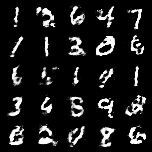

# Wasserstein GAN with gradient penalty
WGAN leverages the Wasserstein distance to produce a value function which has better theoretical properties than the original. WGAN requires that the discriminator (called the critic in that work) must lie within the space of 1-Lipschitz functions, which the authors enforce through weight clipping. However, weight clipping in WGAN leads to optimization difficulties and make the critic a pathological value surface.

[WGAN-GP](https://arxiv.org/abs/1701.07875) propose an alternative way to enforce the Lipschitz constraint, i.e., adding a gradient penalty instead of hard clipping. WGAN-GP does not suffer from the same problems WGAN suffers from.
<p align="middle">
    
</p>

## Algorithm
<p align="middle">
    
</p>

## Example
```
python wgan_gp/wgan_gp.py --n_epochs 200 --batch_size 64 --image_size 28 --latent_dim 100 --clip_value 0.01 --n_critic 5
```

## Results
Images generated by generators at different iterations with image numbers indicates how many batches have been used to feed the generator. (23200 -> 102400 -> 187200)
<p align="middle">
    
    
    
</p>
